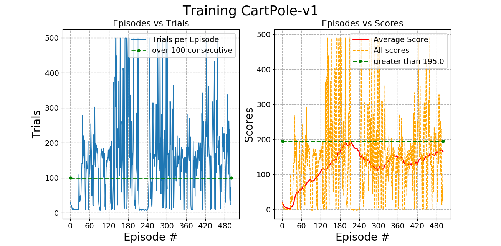
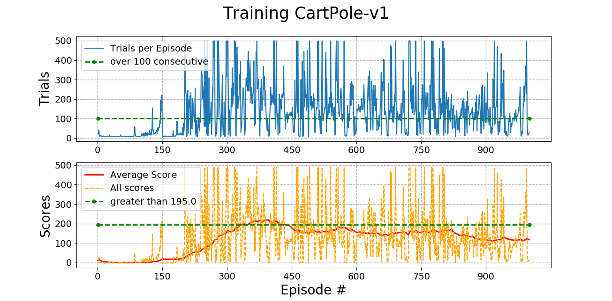
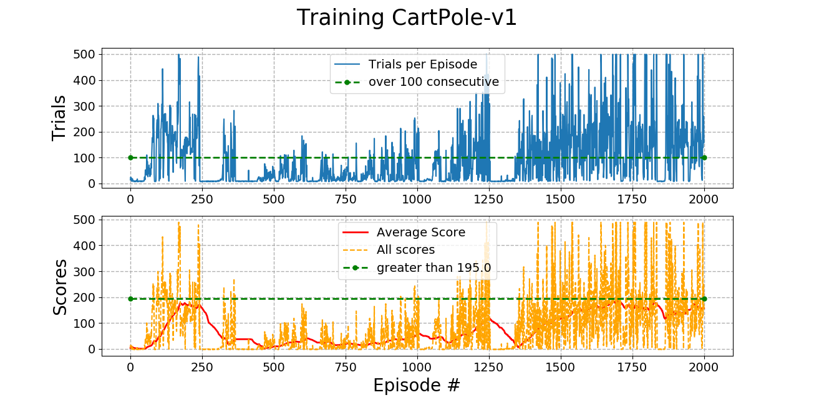

## Reinforcement Learning in CartPole-v1
This task has been done using [gym](https://gym.openai.com/) from OpenAI.

Animation is into Google Colab file. 

### Result with 500 Episodes

### Result with 1000 Episodes

### Result with 2000 Episodes

